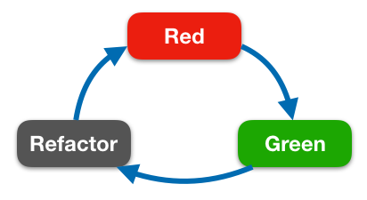

#  Test-driven Development (TDD) in practice

TDD (Test-Driven Development): All code is guilty until proven innocent. 
This is a methodology indicates that we writes tests before writing supporting code. 

Benefits: 
- The tests proves the developer the list of expect behaviors the app should perform. 
- Testing and coding go hand in hand in TDD practice, and the result is better code coverage. 
- TDD is very helpful in pair programming, where one developer writes tests and the other writes code to pass the tests. This practice leads to faster development cycle and reboot code.

The TDD flow can be describe as the red-green-refracto cycle:

It consist of: 
1. Red: Writing a failing test 
2. Green: Writing just enough code to make the test pass
3. Refactor: cleaning up and optimizing your code. 
4. Repeat the previous steps until we're satistifed tat we've covered all the tst cases 

Also, we used some CI workflows on this project: 
1. Termail Command line 
2. [Travis CI](https://travis-ci.com)
3. [Bitrise](https://app.bitrise.io)
4. [Jerkins](https://jenkins.io/index.html)

